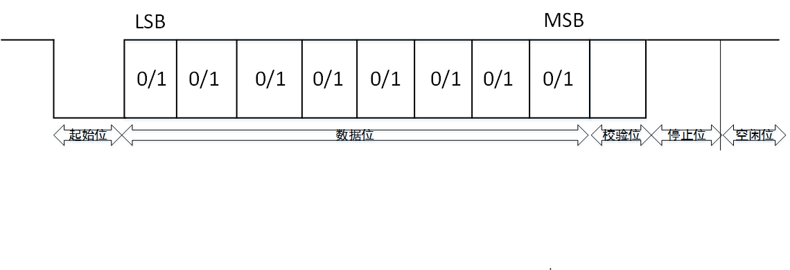

# UART
通用串行数据总线，用于异步通信。可实现双向全双工传输和接收。
## 通信协议和传输时序
发送端将接收到的并行数据转为串行数据。消息帧从一个低位起始位开始，后面是7个或8个数据位，一个可用的奇偶位和一个或几个"高位"停止位。

接收端发现开始位时知道数据即将到来，并尝试与发送器时钟频率同步。接收过程中，UART从消息帧中去掉起始位和结束位，对数据位进行奇偶校验，并将串行数据转换成并行数据。

如果选择了奇偶校验，UART就在数据位后面加上奇偶位，用来帮助错误校验。

发送数据过程，空闲状态，线路处于高电位

