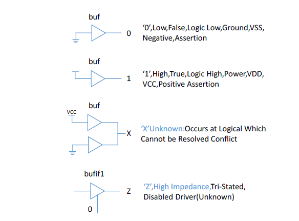
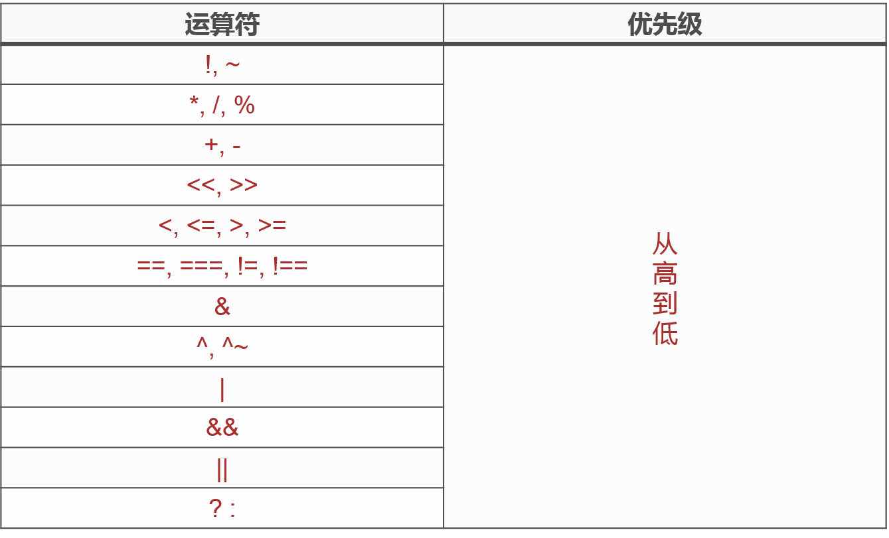

# Verilog语言基础
## 1. timescale
timescale一般用于仿真激励文件中，它用来定义仿真的时间单位和时间精度，时间精度不能大于时间单位，且数字只能是1,10,100。具体地：
```
`timescale 1ns / 1ps
```
```
`timescale 100ns / 10ns
```
## 2. Vivado XDC约束文件
主要完成管脚，时钟，以及组的约束。
- 配置CFGBVS管脚电压
```
set_property CFGBVS VCCO [current_design]
```
- 配置电路的电压
```
set_property CONFIG_VOLTAGE 3.3 [current_design]
```
- 配置普通IO管脚，只需约束引脚号和电压。端口号若为数组，需要用{}括起来
```
set_property PACKAGE_PIN 引脚编号 [get_ports 端口名称]
set_property IOSTANDARD 电压 [get_ports 端口名称]
```
- 约束时钟周期，差分时钟只要定义和约束P脚
```
create_clock -period 5 [get_ports sys_clk_p]
```
## 3. FPGA供电电压
- 核心电压VCCINT，为内部逻辑门和触发器供电
- IO电压VCCO（Xilinx，Altera简称VCCIO），通常以Bank为界，一个Bank内只存在一种电源电压，每个Bank可以与一种电平接口芯片通信。
- 辅助电压VCCAUX，为一些模拟组件提供独立稳定的电源，如DCM数字时钟，高速串并转换器等

## 4. FPGA Speed Garde
对于CPLD来说，速度等级指的是PIN to PIN延时，数字越小，信号穿过芯片的时间越小，即速度越高。

对FPGA来说，速度等级一开始指的穿过查找表的时间，后来没有特指哪一条时间路径。嘤嘤~~。对XILINX的FPGA来说，数字越大，等级越高。

芯片的速度等级取决于芯片内部的门延时和线延时，说到底，取决于生产工艺。一般在芯片产出之后，对芯片进行测试，筛选，然后划分不同的速度等级和标价。

## 5. Xilinx 时钟原语

```
IBUFGDS #
    (
     .DIFF_TERM ("FALSE"),
     .IBUF_LOW_PWR ("FALSE"),
    )
    u_ibufg_sys_clk
      (
      .I (sys_clk_p),   //差分时钟正端输入
      .IB (sys_clk_n),   //差分时钟负端输入
      .O (sys_clk_ibufg) // 时钟缓冲输出
      );
```
将开发板上的差分时钟转换成单端全局时钟。
IBUFGDS是IBUFG的差分形式，当信号从一对差分全局时钟管脚输入时，必须使用IBUFGDS作为全局时钟输入缓冲。

## 6. Xilinx ODDR2原语
ODDR2作用：xilinx FPGA中PLL产生的时钟不能直接输出到板卡的通用IO口，需要在两者之间添加ODDR2模块来减少延迟和抖动。

如果直接将BUFG连接到OBUF（Output Buffer）上，在编译器map的过程中出出错，此时在约束文件里加上
```
PIN "OUT20_40M/clkout2_buf.O" CLOCK_DEDICATED_ROUTE = FALSE; 
```
编译器会忽略时序要求，直接与普通IO相连，相应地，时钟输出的时延和抖动会变差。
```
ODDR2 #(
    .DDR_ALIGNMENT("NONE"), //set output alignment to "NONE","C0" or "C1"
    .INIT(1'b0),    //Set initial state of the Q output ot 1'b0 or 1'b1
    .SRTYPE("SYNC") //specifies "SYNC" or "ASYNC" set/reset
    ) 
    ODDR2_inst      //there should be a name
    (
    .Q(clk_out),    //1-bit DDR output data
    .CO(pll_clk_o), //1-bit clock input
    .C1(~pll_clk_o),//1-bit clock input
    .CE(1'b1),      //1-bit clock enable input
    .D0(1'b1),      //1-bit data input (associated with C0)
    .D1(1'b0),      //1-bit data input (associated with C1)
    .R(1'b0),       //1-bit reset input
    .S(1'b0)        //1-bit set input
    );
    
```

## 7. 捕获时钟沿
上升沿：

```
always @(posedge clk)
begin
    //上升沿变成高电平
    wrsigbuf <= wrsig;
    wrsigrise <= (~wrsigbuf) & wrsig;
end
```
下降沿：

```
always @(posedge clk)  
begin
    //下面两句将rx的下降沿变成rxfall的高电平
    rxbuf <= rx;
    rxfall <= rxbuf & (~rx);
end 
```
## 8. 四值逻辑系统


## 9. Verilog数据类型
- **寄存器数据类型**
    
    寄存器数据类型只能在always和initial语句等**过程语句**中被赋值，缺省值为X。

    常见的类型有：reg integer real等
    ```
    reg a;
    reg [7:0] b;
    reg [7:0] c,d,e;
    ```
- **线网数据类型**

    表示结构化元件之间的物理连线，它的值由驱动元件的值决定，如果没有连接到驱动元件，默认值为Z。
    
    常见的类型有tri,wire,wand等
    ```
    wire a;
    wire [7:0] b;
    wire [7:0] c,d,e;
    ```
    
- **参数数据类型**
    
    即常量，通常出现在Module内部，用来定义状态机的状态，数据的位宽的延迟的大小等。
    
    ```
    parameter N = 8'd15;
    parameter A = 4'b0001,
              B = 4'b0010,
              C = 4'b0100;
    ```
- **如何正确选择端口数据类型**

    assign是针对wire型变量的一种赋值语句，wire变量的值是会随着驱动源的变化而变化，称之为**连续**赋值语句。

    在Verilog中，任何**过程**赋值语句（always @( posedge clk)）的左侧变量必须声明为reg。

    模块输入信号只能为线网数据类型，一般为wire型。输入信号可以由线网型和寄存器型数据信号驱动。
    
    模块输出信号可以是线网型或寄存器型，但输出端口只能驱动线网型。
## 10. Verilog运算符
- 算术运算符
    
    "+", "-", "*", "/", "%"
- 关系运算符
    
    <,>,<=,>=,==,!=
- 逻辑运算符

    &&, ||, !
- 条件运算符

    ? :
- 位运算符
    
    " ~ ", " & ", " | "," ^ ", " ~^ ", " ^~ "
- 移位运算符
    
    \<<, >>
- 拼接运算符

    {}，{a,b}，将a，b拼接起来
    
    {{}}，{a{b}}，将b重复a次
- 运算符优先级

    


## 11. Verilog关键字    

可综合关键字和不可综合关键字

## 12. Verilog的抽象级别

- 行为级描述方式
    
    抽象级别最高，代码描述的主要是真值表。
    分为系统级抽象，算法级抽象
- 数据流描述方式
    
   抽象级别次之，代码描述的主要是逻辑表达式。有RTL级（寄存器传输级）抽象
    
- 结构化描述方式
    
    抽象级别最低，最接近实际的硬件结构。代码主要描述的是逻辑电路结构。分为门级抽象和开关级抽象
    
    
## always

```
always @(*) 
//组合逻辑电路描述方式，敏感表*表示全部敏感变量
```


