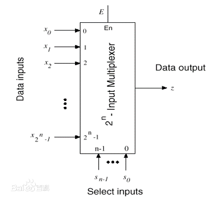
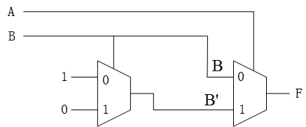
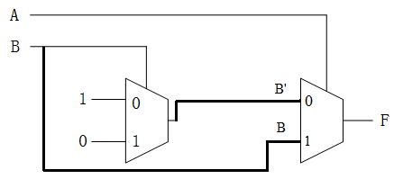
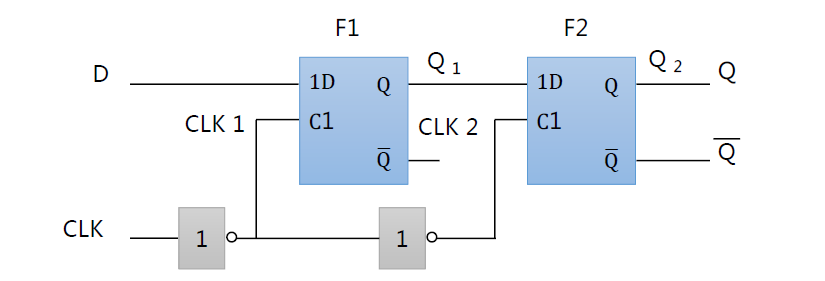
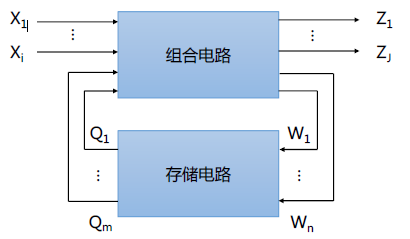

## 1. MUX
数字选择器，即“单刀多掷”开关。 



Select inputs，通过二进制组合实现对Data inputs的选择输出。二选一数据选择器可以用作一个反相器。
## 2. 异或
- 运算符号：xor,⊕
- 逻辑表达式：F = A'B +AB'
- 口诀：相同为0，不同为1
- 异或门可以由两个2MUX串联实现，前一个实现B的反相，后一个控制B与B'的选择。



## 3. 同或
- 运算符号：⊙
- 逻辑表达式：F = A'B' + AB
- 口诀：相同为1，不同为0
- 同或门可以由一个异或门和一个反相器组成。也可以由两个2MUX组成。



## 4. 锁相环
Phase-locked loops是一种利用反馈控制原理实现的频率和相位的同步技术。
通常由鉴相器（PD, Phase detector），环路滤波器（LP, Loop filter）和压控振荡器（VCO，Voltage controlled oscillator）构成。可以对输入时钟进行倍频。

一个FPGA芯片中PLL的数量是衡量FPGA芯片能力的重要指标，使用一个PLL可以从一个输入时钟信号生成多个时钟信号。

## 5. 组合逻辑电路
当前的输出只和当前的输入有关，而与之前的输入无关，这种电路称之为组合逻辑电路。

- ### 分析方法
    组合逻辑电路>逻辑表达式>最简表达式>真值表>逻辑功能
- ### 公式化简
    基本定律：自等率，互补率，交换律，反演律，分配率，结合律

    基本规则：代入规则，反演规则，对偶规则

    基本方法：并项法，吸收法，消项法，消因子法，配项法

- ### 卡诺图化简
    将真值表的最小项重新排列，横纵坐标按格雷码顺序排列。 

    最小项：指n个变量X1、X2、···、Xn的最小项是n个因子的乘积，每个变量都以它的原变量或非变量的形式在乘积中出现，且仅出现一次。

- ### 格雷码
    循环性，单步性，每次变换只变一位，减少误码

- ### 设计方法

    时间问题>真值表>逻辑表达式>最简表达式>逻辑图

- ### 竞争与冒险

    逻辑竞争：指在组合电路中，某一信号经过两条以上路径达到输出端的时间先后不同的现象

    逻辑冒险：由于延时的存在，当输入变化时，输出产生错误的波形，这一现象称为逻辑冒险。有竞争的地方不一定有冒险。

    以上情况，输入变量只有一个。

    消除：增加冗余项，增加选通信号，增加输出滤波电容。

    功能竞争与功能冒险：多个变量。

    卡诺图判别功能冒险的方法

    消除：改变电路逻辑设计无法消除功能冒险，只能增加选通信号或增加输出滤波电容。

- ### 应用
    编码器，译码器，数据选择器，数值比较器，加法器

## 6. 时序逻辑电路
有记忆，任何时刻的输出信号，不仅与当前的输入有关，而且还与以前的输入信号有关。

- ### 存储电路

    锁存器：采用电平触发的方式

    触发器：脉冲边沿触发

1. 基本RS锁存器

    两个与非门或者两个或非门组成。
    
    或非门组成的RS触发器，高电平有效，特性方程如下：
    
    ```math
    Q ^ {n+1}=S + R'Q^n
    
    SR=0
    ```
    与非门组成的RS触发器，低电平有效，特性方程如下：
    ```math
    Q^{n+1}=S + R' Q^n
    
    S+R=1
    ```
2. 钟控RS锁存器

    两个与门+两个或非门，外加一路控制信号C。使原来的S变成SC，R变成RC。
    
3. 钟控D锁存器
    
    四个与非门构成，输入：C和D。
    当C=0时，输出Q维持不变；当C=1时，Q=D
    ```math
    R^{n+1} = D
    ```
4. 空翻
    
    在时钟C=1器件，由于引脚电平突变而引起的不想要的Q的翻转，这种现象称为空翻
        

5. D触发器
    
    由于电平触发器存在空翻现象，所以有了边沿触发器

    
    
    CLK=0时，C1=1，C2=0，F1选通，F2被锁，Q1=D，Q2保持；
    
    CLK=1时，C1=0，C2=1，F1被锁，F2选通，Q1保持，Q2=Q1。
    
    D触发器输出信号Q2只有在CLK上升沿时才会被改变
6. 寄存器
    
    由多个D触发器并联组成，可以存储多位二进制数码，有两种工作状态，分别是寄存和保持。
    
    此外，还有移位寄存器，由D触发器串联组成。
7. 计数器


- ### 时序电路描述方式

    特性表，特性方程，状态转移图，波形图

- ### 时序电路的分析
    根据输出信号的特点，将时序电路分为摩尔（Moore）型和米里（mealy）型两类电路。摩尔型电路输出信号只取决于存储电路的状态，米里型电路输出信号不仅取决于存储电路的状态，还取决于外部输入信号。
    
    时序逻辑电路结构框图

    

    方程组
    
    ```math
    Z=F(X,Q^n)
    
    W=G(X,Q^n)
    
    Q^{n+1}=H(W,Q^n)
    ```
- ### 时序电路的设计
    与分析互为逆过程。

    状态转移图→特性表→状态方程驱动方程，输出方程→电路图
    
## 7. 可编程逻辑器件

> ### 存储器

- ### ROM
    由存储矩阵，地址译码器和输出缓冲器组成。ROM存储的信息在制造时由生产厂家一次性写入，工作时只能读出信息，不能写入信息。掉电不丢失信息。
- ### PROM
    总体结构与ROM相似，但是在原有二极管的基础上串了一个可熔断熔丝。在写入数据时，将存0的存储单元上的熔丝烧断即可。一经写入，无法修改。
- ### EPROM
    可擦除，可重新编写。改写时，需要专用的紫外线灯照射芯片上的受光窗口，存储的信息全部被擦除。
- ### EEPROM
    擦除和编程都用电完成，可整片擦除，也可独立擦除某一部分，擦除时间在10ms内，可重复编程1万次以上。 

- ### RAM
    与ROM最大的区别，掉电丢失数据。所以主要用来存储短时间内使用的数据。
    - SRAM
        利用触发器的稳态来表示信息0和1，不需要刷新，存储速度比DRAM快，价格比DRAM高，容量较小，常用作高速缓冲存储器Cache。
    - DRAM
        利用电容有无电荷来表示信息0和1，为防止电容漏电而导致信息读取出错，需要周期性给电容充电，即刷新。DRAM保留数据的时间较短，速度也比SRAM慢，价格低。

> ### 可编程逻辑阵列和可编程阵列逻辑

- ### 可编程逻辑阵列（Programmable Logic Array, PLA）

    利用率高，能解决输入变量过多导致规模迅速增加的问题。但是，可编程的或门矩阵和与门矩阵结构导致软件算法过于复杂，编程难度大，费用高，编程后运行速度下降。

- ### 可编程阵列逻辑（Programmable Array Logic, PAL）
    
    可编程的与门矩阵，固定的或门矩阵。

    在PAL的基础上，后续又有GAL问世

> ### FPGA和CPLD

- ### CPLD (Complex Programmable Logic Device)
    主要由逻辑阵列块（logic array block, LAB)，宏单元（Macro cells)，可编程连线（PIA, Programmable interface array）和IO控制块四部分组成。基于乘积项的可编程结构，LAB内部有若干宏单元，每个宏单元框架采用与门阵列和或门阵列。

    由于采用中心全局器件互连的布局，所以随着LAB的增加，PIA呈指数增加，布线资源占用大量面积。
- ### FPGA (Filed-Programmable Gate Array)
    采用行列互连方式，LAB均匀分布在阵列中，布线资源随LAB线性增加。

    FPGA的LAB由大量逻辑单元LE构成，LE是基于查找表（Look-up Table, LUT）结构的。LUT可以看成一个RAM，把输入当成地址，对应的存储内容当成输出。
    
    结构组成：LAB，IO单元，布线资源


    


    
    
    

 


